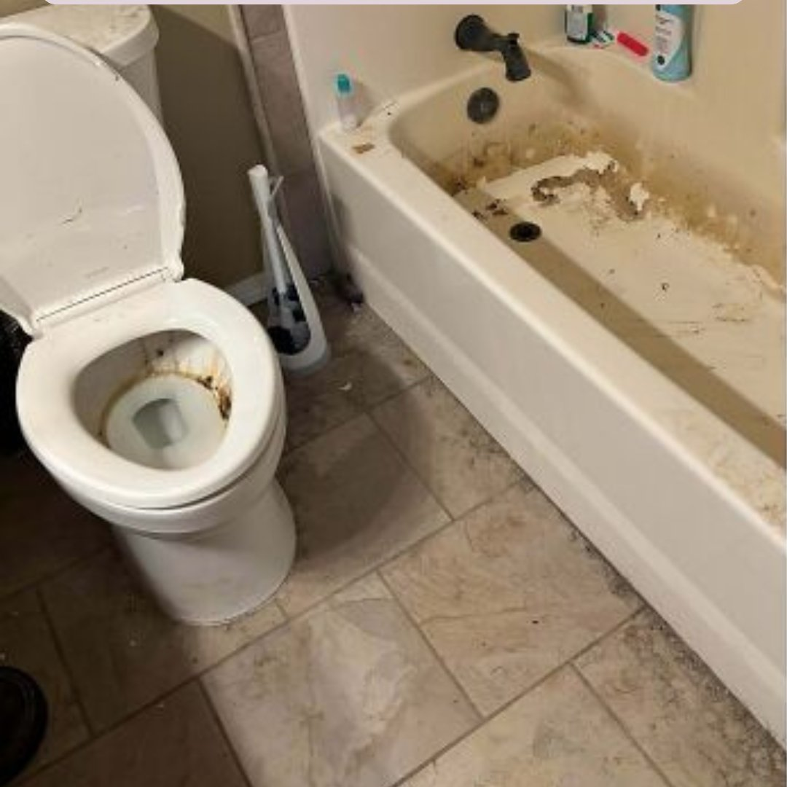
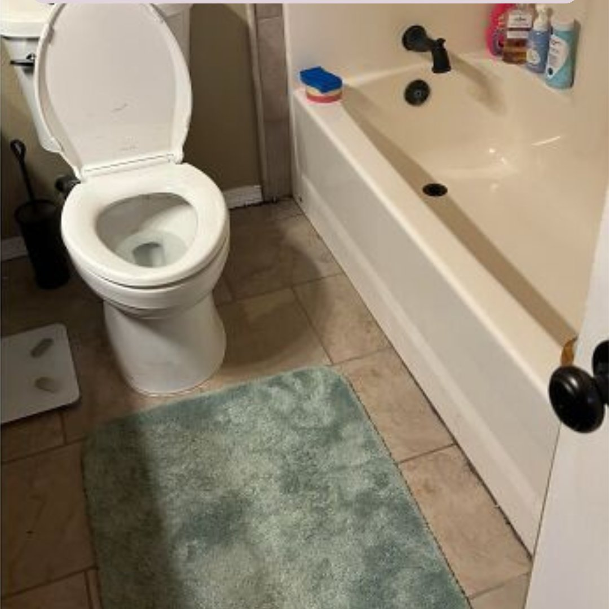
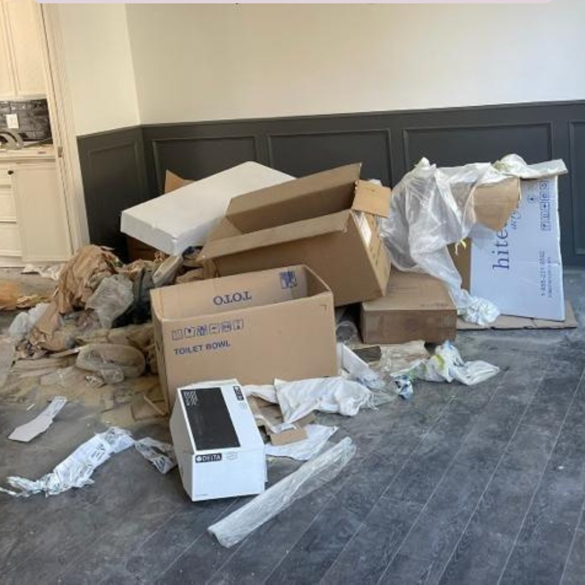
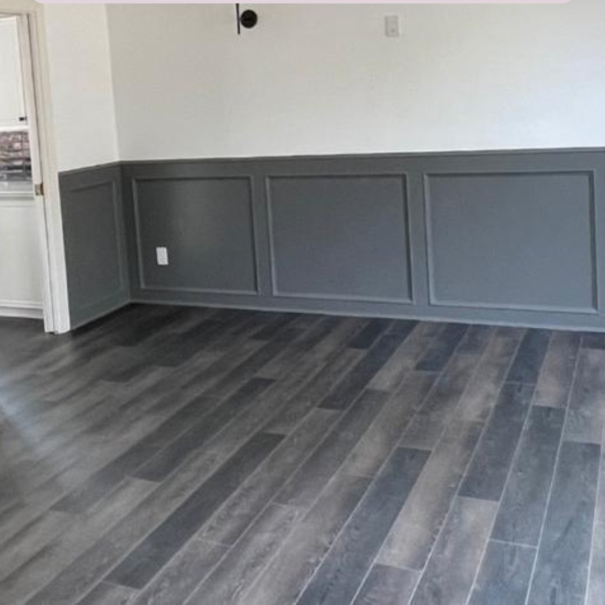

<!DOCTYPE html>
<html lang="en">
<head>
<meta charset="UTF-8"/>
<meta name="viewport" content="width=device-width, initial-scale=1.0"/>
<title>Top Hat Cleaners | Professional Cleaning Service in San Antonio, TX</title>
<meta name="description" content="Top Hat Cleaners — Professional residential and commercial cleaning in San Antonio, TX. Real before/after results, fully insured, 100% satisfaction guarantee. Call (726) 888-9821."/>
<meta name="keywords" content="cleaning service San Antonio, San Antonio cleaners, house cleaning San Antonio TX, commercial cleaning, Airbnb turnover, post-construction cleaning, move-out cleaning San Antonio"/>
<meta name="author" content="Top Hat Cleaners"/>
<meta name="robots" content="index, follow"/>
<meta name="geo.region" content="US-TX"/>
<meta name="geo.placename" content="San Antonio"/>
<meta name="geo.position" content="29.4241;-98.4936"/>
<meta name="ICBM" content="29.4241, -98.4936"/>

<meta property="og:title" content="Top Hat Cleaners | Professional Cleaning in San Antonio, TX"/>
<meta property="og:description" content="See real before/after results from our cleaning service. Fully insured San Antonio cleaners with 100% satisfaction guarantee."/>
<meta property="og:type" content="website"/>
<meta property="og:locale" content="en_US"/>
<meta property="og:image" content="img/logo.png"/>

<meta name="google-site-verification" content="YOUR_VERIFICATION_CODE_HERE"/>

<link rel="canonical" href="/"/>
<link rel="icon" type="image/png" href="img/logo.png"/>
<link rel="apple-touch-icon" href="img/logo.png"/>
<link href="https://fonts.googleapis.com/css2?family=Playfair+Display:ital,wght@0,400;0,700;0,800;1,400;1,600&family=DM+Sans:wght@300;400;500;600;700&display=swap" rel="stylesheet"/>
<link rel="stylesheet" href="styles.css"/>

</head>
<body>

<!-- Navigation -->
<nav class="nav">
  <a href="index.html" class="nav-brand">
    
    
Top Hat CleanersSan Antonio, TX

  </a>
  

    <a href="index.html" class="nav-link active hide-sm">Home</a>
    <a href="services.html" class="nav-link">Services</a>
    <a href="index.html#gallery" class="nav-link hide-sm">Our Work</a>
    <a href="book.html" class="nav-cta">Book Now</a>
  

</nav>

<!-- HERO -->
<section class="hero">
  

    
    

      
★ Fully Insured

      
★ 100% Guaranteed

      
★ Locally Owned

    

    <h1 class="h1">Cleaning, <em>Delivered with Class.</em></h1>
    
Professional residential and commercial cleaning service in San Antonio. Real before/after results, fully insured, with a 100% satisfaction guarantee.

    

      <a href="book.html" class="btn btn-gold btn-lg">Book Online →</a>
      <a href="#gallery" class="btn btn-ghost btn-lg">See Our Work</a>
    

    

      

        
100%

        
Guaranteed

      

      

        
$1M

        
Insured

      

      

        
SATX

        
Locally Owned

      

    

  

</section>

<!-- TRUST STRIP -->
<section class="trust-strip">
  

    

✓
 Background-checked teams

    

📸
 Before/after photos

    

🛡
 $1M liability insurance

    

⏱
 Same-week availability

  

</section>

<!-- BEFORE/AFTER GALLERY -->
<section class="ba-section section" id="gallery">
  

    

      
Real Results · Real San Antonio Homes

      <h2 class="h2">See the Top Hat <em>Difference</em></h2>
      
Every job comes with documented before and after photos. No filters, no fakery — just honest, professional cleaning work.

    

    

      

        

          

            
            
Before

          

          

            
            
After

          

          
→

        

        

          
Deep Clean — Bathroom

          <h3>From Neglected to Pristine</h3>
          
Heavy buildup in the toilet bowl, mineral and grime stains throughout the tub — handled top to bottom. Every fixture polished and floor detailed.

        

      

      

        

          

            
            
Before

          

          

            
            
After

          

          
→

        

        

          
Post-Construction — The Reveal

          <h3>Construction Site to Move-In Ready</h3>
          
A full post-construction cleanup — debris hauled, every surface wiped, floors detailed and polished. Ready for the homeowner to walk in and just live.

        

      

    

    

      <a href="book.html" class="btn btn-p btn-lg">Book Your Service →</a>
    

  

</section>

<!-- SERVICES -->
<section class="section" style="background:white;">
  

    

      
Our Services

      <h2 class="h2">Cleaning, <em>Tailored to You</em></h2>
      
From quick refreshes to full deep cleans, Airbnb turnovers, office contracts, and post-construction work.

    

    

      

        
I

        
Basic Clean

        <h3>The Refresh</h3>
        
For the home that just needs to feel right again. Perfect for weekly upkeep.

      

      

        
★ Most Loved

        
II

        
Deep Clean

        <h3>The Signature</h3>
        
When it's been a while and you want a fresh start — this is where we begin.

      

      

        
III

        
Move-In / Out

        <h3>The Fresh Start</h3>
        
Hand over or receive keys to a space that feels brand new.

      

      

        
IV

        
Airbnb · STR

        <h3>The Turnover</h3>
        
So your guests always walk into a 5-star space — every single time.

      

      

        
V

        
Commercial

        <h3>The Executive</h3>
        
For offices, clinics, and retail spaces that demand polish.

      

      

        
VI

        
Post-Construction

        <h3>The Reveal</h3>
        
After the build is done — we make it shine, ready to move in.

      

    

    

      <a href="services.html" class="btn btn-s">View Full Service Menu →</a>
    

  

</section>

<!-- HOW IT WORKS -->
<section class="how-section section">
  

    
Simple Process

    <h2 class="h2">How It Works</h2>
    
Three steps and your space is handled — start to finish.

    

      

        
1

        <h3>Book Online</h3>
        
Pick your service, date, and time online — or call/text us to book directly.

      

      

        
2

        <h3>Get Confirmed</h3>
        
We'll send a confirmation with all the details so you know exactly what to expect.

      

      

        
3

        <h3>Enjoy a Spotless Space</h3>
        
Walk into a home or office that looks and feels like a fresh start.

      

    

  

</section>

<!-- AREAS SERVED -->
<section class="areas-section section">
  

    

      
Local · Trusted · Texan

      <h2 class="h2">Proudly Serving <em>Greater San Antonio</em></h2>
      
From downtown to the Hill Country and everywhere in between.

    

    

      
📍 San Antonio

      
📍 Alamo Heights

      
📍 Stone Oak

      
📍 Helotes

      
📍 Schertz

      
📍 Cibolo

      
📍 Boerne

      
📍 New Braunfels

    

  

</section>

<!-- TOP HAT PROMISE -->
<section class="section" style="background:white;">
  

    

      
⭐ Our Guarantee

      <h2 class="h2">The <em>Top Hat Promise</em></h2>
    

    

      

        
★★★★★

        
If you're ever less than completely satisfied, simply let us know within 24 hours and we'll return to make it right — no hassle, no runaround. That's our 100% satisfaction promise.

        

          
🎩

          

            
100% Satisfaction Guarantee

            
Top Hat Cleaners — every job, every time

          

        

      

      

        
★★★★★

        
Reliability. Communication. Quality. We show up on time, send before and after photos of every room, and follow up after every single clean.

        

          
📸

          

            
The Top Hat Standard

            
Professional · Insured · Documented

          

        

      

    

  

</section>

<!-- FINAL CTA -->
<section class="final-cta section">
  

    <h2 class="h2">Ready for a <em style="color:var(--gold-light);">spotless space?</em></h2>
    
Book online for jobs 14+ days out, or call/text for sooner availability.

    <a href="book.html" class="btn btn-gold btn-lg">Book Online Now →</a>
    

      <a href="mailto:tophatcleaners210@gmail.com" class="contact-card">
        
Email

        
tophatcleaners210@gmail.com

      </a>
      <a href="tel:+17268889821" class="contact-card">
        
Call or Text

        
(726) 888-9821

      </a>
    

  

</section>

<!-- FOOTER -->
<footer class="footer">
  
  
Top Hat Cleaners

  
— Cleaning with Class —

  

    <a href="index.html">Home</a>
    <a href="services.html">Services</a>
    <a href="book.html">Book Online</a>
    <a href="mailto:tophatcleaners210@gmail.com">Email</a>
    <a href="tel:+17268889821">Call/Text</a>
  

  

    <a href="mailto:tophatcleaners210@gmail.com">tophatcleaners210@gmail.com</a> · <a href="tel:+17268889821">(726) 888-9821</a>
  

  

  

    Top Hat Cleaners · San Antonio, TX · (726) 888-9821 
    Instagram: @tophatcleeaners210 · Facebook: Top Hat Cleaners Co. 
    © 2026 Top Hat Cleaners. All rights reserved.
  

</footer>

</body>
</html>
